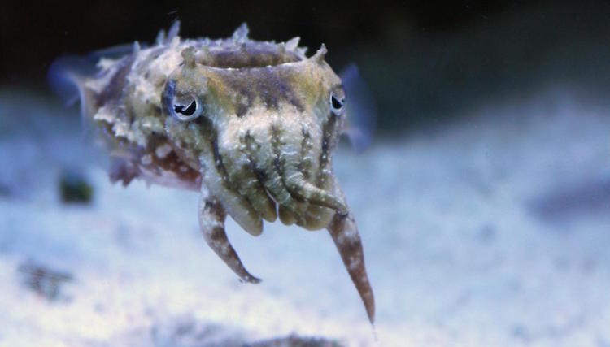
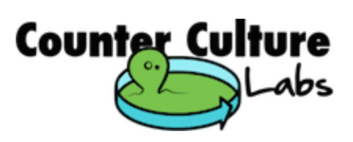

# Cuttlefish Wranglin'

Studying the RNA Editing capabilities of [_Sepia bandensis_](https://en.wikipedia.org/wiki/Sepia_bandensis) (dwarf cuttlefish).

## What is this?

This is an ongoing meeting of a group of citizen scientists that aim to dive deep into the genome of Sepia bandensis (dwarf cuttlefish). Our plan is to perform genome and transcriptome analysis of this species, ultimately leading to the identification of highly edited RNA transcripts. We hope to leave with a clear picture of experimental design but we hope to find a correlation between changing environmental conditions and RNA editing capabilities. For added fun, the edited proteins can be expressed and analyzed for structure and function!

## Who is this for? Can I join?
This is a community project and open to everyone all members seeking to dive deep into genome / transcriptome analysis. Attendees must be middle school aged or older.

If you have bioinformatics or cuttle wranglin' experience or experience setting up and managing a reef tank, your participation is welcome! We also greatly appreciate donations to the project via the PayPal link below.

  <form action="https://www.paypal.com/cgi-bin/webscr" method="post" target="_top">
    <input type="hidden" name="cmd" value="_s-xclick">
    <input type="hidden" name="hosted_button_id" value="U7K8BK9P8DR2A">
    <input type="image" src="assets/donantepaypal.jpg" border="0" name="submit" alt="PayPal - The safer, easier way to pay online!">
    
  </form>

## When and Where?
Meetings are at [7:30pm PST every other Tuesday](https://www.meetup.com/BioCurious) at [Biocurious](http://biocurious.org).

## Resources
* [Meeting Notes](https://docs.google.com/document/d/1JQW_J8UX77whb3dbjCJqK4wTH9LWHJRcv5fUFNDzw6g/edit?usp=sharing)
* [Papers](https://drive.google.com/open?id=0BzfcnT9KAmhaamQxZDNjdnhvV1E)

   

  Meetings hosted by <a href="http://www.counterculturelabs.org">Counter Culture Labs (CCL)</a> and <a href="http://biocurious.org">BioCurious</a>.

  <table align="center">
    <tr>
      <td></td>
      <td></td>
    </tr>
  </table>

