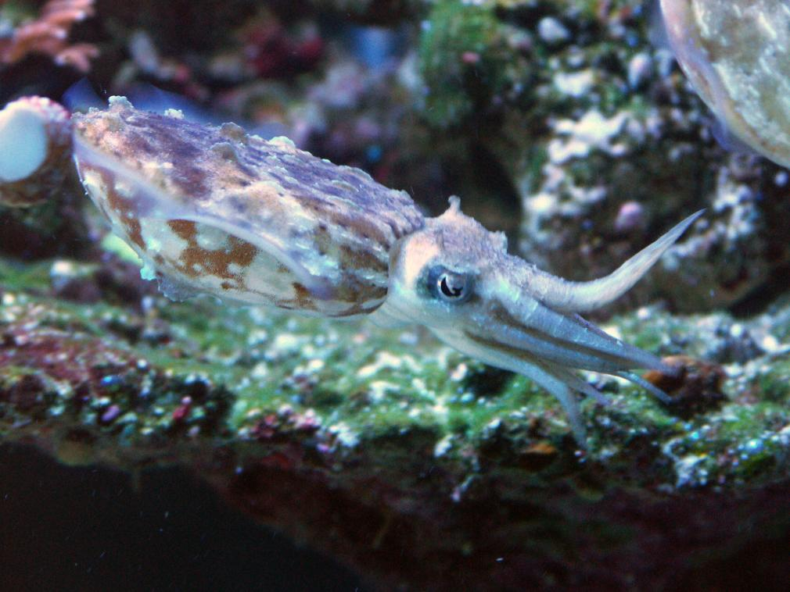
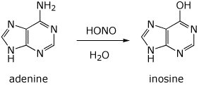

## Introduction
* The idea for this project came out of recent research the RNA editing capabilities housed within the genome of cephalopods.
* Found that RNA (instead of DNA) is highly edited in Octopus sp.
  * Occurs mostly in neurological tissue, but can also occur in other peripheral tissues.
* Cuttlefish have not been studied.
* In preparing for RNA transcriptome analysis, we realized that we did not have a reference sequence to compare our transcriptome analysis to, so we decided to sequence the genome as well.

## _Sepia bandensis_

* Mollusca (phylum) —> Cephalopoda (class)
* Found off the coast of Philippines, Papua New Guinea and Indonesia in shallow water (water of 78-80F)
* Babies are about 0.5in, adults are up to 2-3 inches.
* 8 arms, with two rows of suckers along each arm, and two feeding tentacles with at least two rows of suckers along each
* Cephalopods have three hearts, a ring shaped brain, blue, copper based blood, and have a lifespan between 6 months and 3 years (Sepia bandensis lives about a year)
* Chromatophores and skin shaping used to hide from predators/hunt

* The cephalopod genome is roughly 2.7GB.
  * There is no completed sequencing data on Cuttlefish (S. officianalis is being analyzed by Kim Worley’s group out of Baylor).
  * We do not know the size of S. bandensis’ genome.
  * We also don’t know how many chromosomes the organism has. S. pharaonic has 48 chromosomes (2N)
* A recent paper showed that RNA editing occurs at greater levels in colder water. Will be interesting to highlight RNA editing in warm water fish

## RNA Editing
* A biological process in which an organism increases its adaptability by editing mRNA transcripts
* Can be paired with gene splicing (i.e. in humans)
* A to I RNA editing occurs when the adenosine is edited to an Inosine via deamination.
  * The resultant nucleotide substitution is a Guanine/Guanosine
  

## Why is this Important?
* RNA editing allows for the expression of functionally diverse proteins from a single gene (i.e. multiple transcripts from one gene) = enhanced adaptability
  * I.e. in an environment where the surrounding temperature changes it is useful to have functional variants of a protein that allows for an increase in ion permeability through the membrane (i.e. increased action potential)
* Studying RNA editing in an organism allows us to answer questions about how the organism adapts to its environment.

## Proposed Work
* Karyotype the organism (how many chromosomes does it have).
* Perform NGS of S. bandensis gDNA.
  * Annotate the genome of S. bandensis (using S. officianalis genomic data as a scaffolding reference).
* Perform RNA Transcriptome analysis of all tissues.
  * Assess frequency of A to G substitutions within the transcriptome.
  * Determine which genes are edited

## What needs to be done?
Cuttle Wranglin’
* Setting up a salt water reef tank
* Maintaining the fish until adulthood
Tissue Processing
* Karyotyping
* Isolating neurological tissue and peripheral tissue
* Prepping gDNA, sending frozen tissues off for RNA library production
Data analysis
* Genome assembly
* Transcriptome analysis

   

> Images from [Daniel Pon](http://reefkeeping.com/issues/2008-10/feature/index.php)
